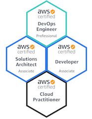

### Hi there 👋

My name is Chuck and I have over twenty years of professional experience in the information technology industry with expertise in web development, client/server development, application integration, project management, customer support, and windows based system administration.

[Here](https://github.com/boyersnet/boyersnet/blob/main/work-from-home.md) is my work from home setup.

My specailties are:

- Amazon Web Services Certified DevOps Engineer – Professional
- Amazon Web Services Certified Developer - Associate
- Amazon Web Services Certified Solutions Architect - Associate
- Amazon Web Services Certified Cloud Practitioner
- MCSD.NET
- Microsoft Development focusing on Internet Technologies
- Application and Systems Architecture
- Cloud Architecture
- SaaS Content Managment Services
- CI/CD
- Agile Development

Fun Facts:

- 🔭 I’m currently working on an on prem to AWS migration
- 🌱 I’m currently learning AWS
- 💬 Ask me about AWS, .NET
- 📫 How to reach me: [@boyersnet](https://twitter.com/boyersnet)

Other stuff:

- [oh-my-posh](oh-my-posh.md) configuration
- [Brewfile](brewfile.md)
