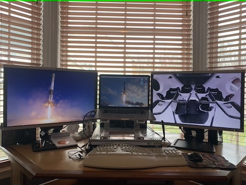
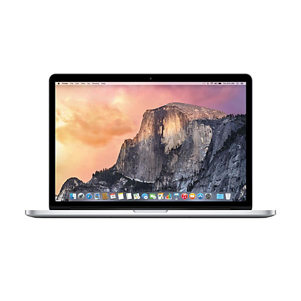
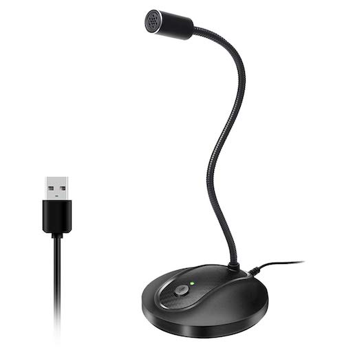
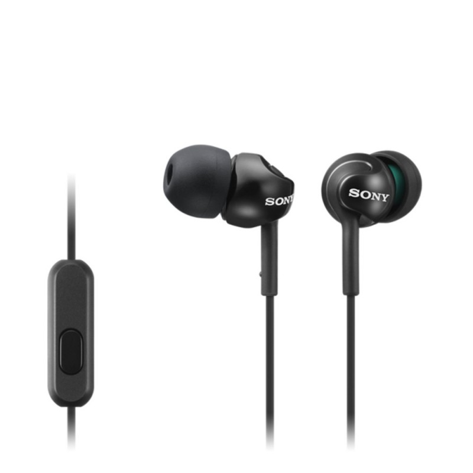
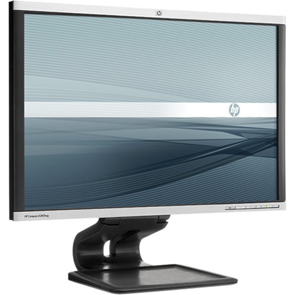
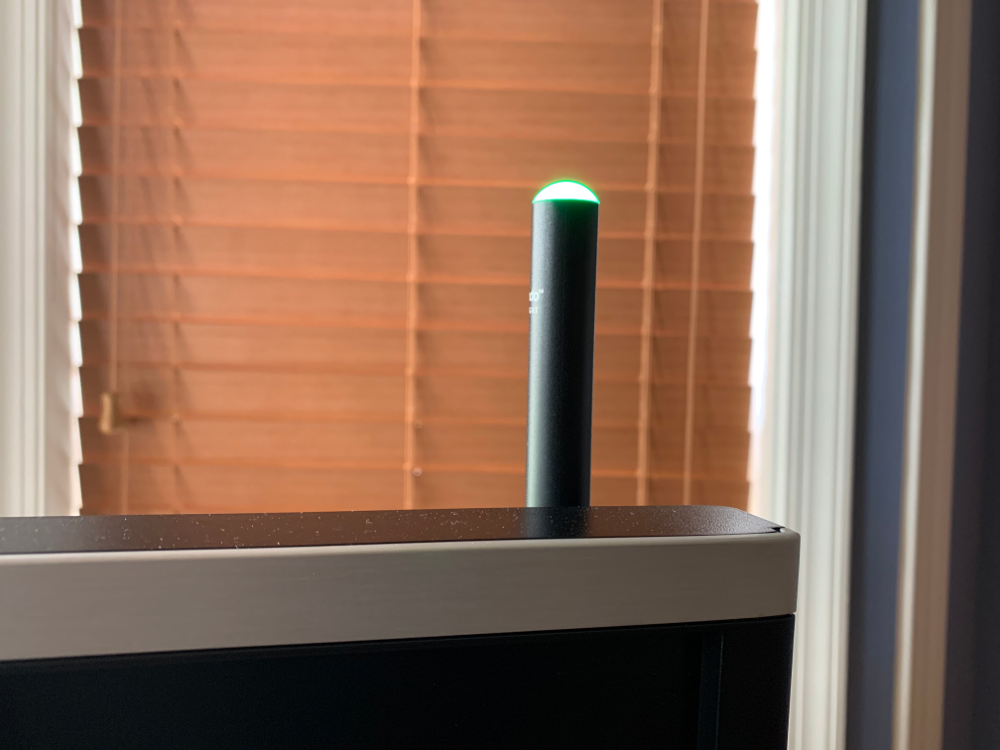
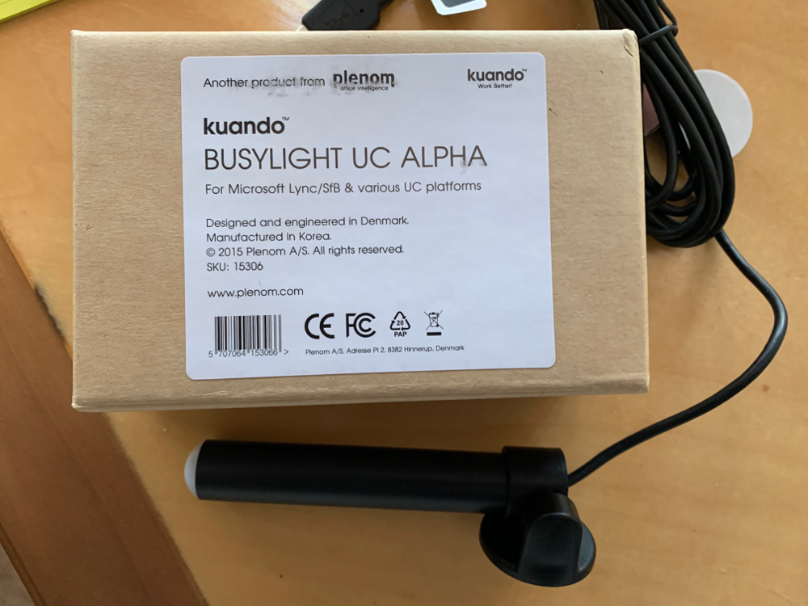
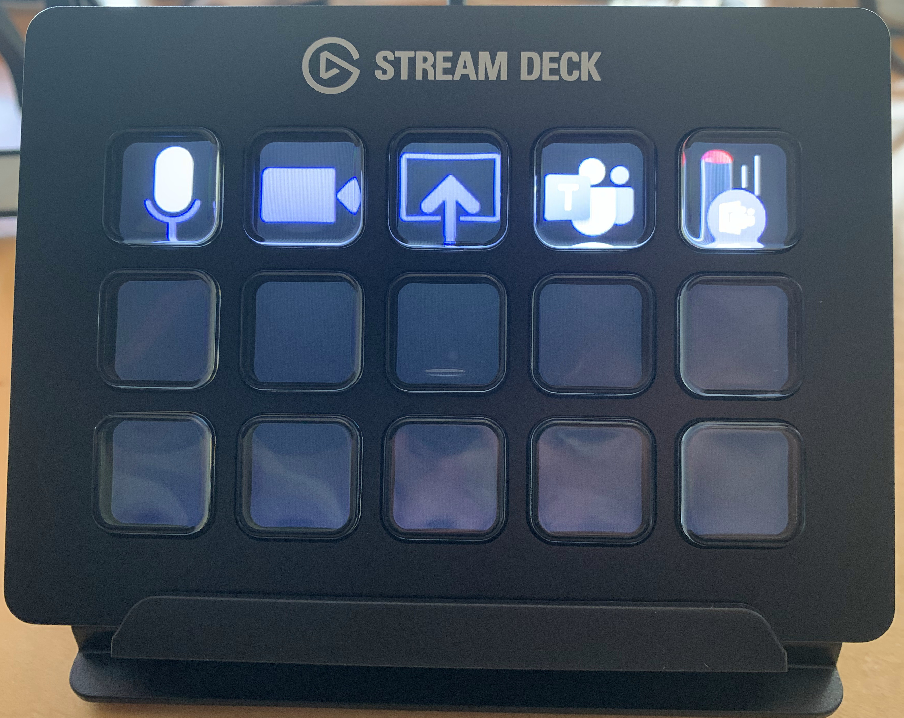

# Work from Home

### Tips

1. Use an external Headset and Mic, not your computer speakers and built in mic.
2. Don't call in, use your computer for audio. The phone exchanges for conferencing systems (GoToMeeting, Zoom, WebEx) are being overwhelmed now that many companies have shifted to remote work due to COVID-19. Computer audio doesn't use the phone exchanges.
3. When you aren't talking, mute yourself.
4. Did I mention the mute button?
5. Please mute yourself.
6. Always assume you are NOT muted
7. Run your video. Your coworkers want to see you. Plus nonverbal communication is important too.
8. Wear pants.
9. Use the chat feature for side conversations and sharing other types of resources (links, documents, etc.)

### My Setup

(Photo prior to Stream Deck and Busylight)

### Tools I use

#### 2015 MacBook Pro

#### Desktop Microphone

[Mic](https://amzn.to/39h32aG) $20

#### Headset

[Headset](https://amzn.to/2UvpF5X) $15

#### Video Camera

I use my Macbook camera but any HD webcam will do.

#### Monitors

2 HP LA2405x monitors.

#### BusyLight

[Plenom BusyLight](https://amzn.to/3fBLECL)

#### Elgato Stream Deck

[Stream Deck](https://amzn.to/3oBaNl2) $149

\*Amazon Links are affiliate links
